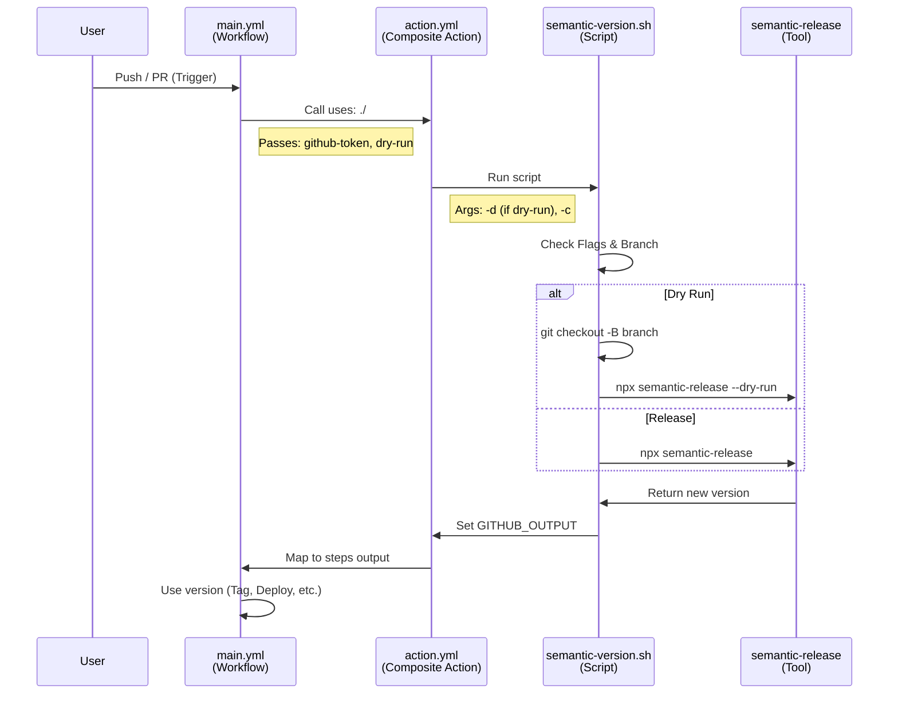

# BakeFoundry Release Workflow

This repository hosts a composite GitHub Action and reusable workflows to automate semantic versioning and releases using `semantic-release`.

## 🔄 Workflow Overview

The system is designed to automatically determine the next version number based on commit messages (Conventional Commits), generate changelogs, create GitHub Releases, and update Git tags. It supports both "Dry Run" mode (for PRs) and actual Release mode (for merges to `main`).

### 🧩 Components

#### 1. `action.yml` (The Core Action)
This is the heart of the repository. It is a **Composite Action** that defines the logic for running the release process.

*   **Responsibility**:
    *   Setup Node.js environment.
    *   Install `semantic-release` and plugins.
    *   Execute the `semantic-version.sh` orchestration script.
    *   Validate Pull Request titles to enforce Conventional Commits.
    *   Output the calculated version numbers.
*   **Inputs**:
    *   `github-token` (Required): The GitHub token to use for authentication.
    *   `dry-run` (Default: `false`): Logic to simulate release without publishing.
    *   `create-component-tags` (Default: `true`): Create Git tags with version components (e.g., `v1`, `v1.2`).
    *   `fail-on-no-release` (Default: `false`): If `true`, the action fails if no new version triggers.
*   **Outputs**:
    *   `release-version`: The new version number.
    *   `last-version`: The previous version number.
    *   `is-new-release`: Whether a new release was created.

#### 2. `version.yml` (Reusable Workflow)
This is a **Reusable Workflow** (`on: workflow_call`) that makes the core action easily consumable by *other* repositories within the organization.

*   **Responsibility**: Wraps the core action in a job mechanism so it can be referenced via `uses: bakefoundry/bk-release-workflow/.github/workflows/version.yml@v1`.
*   **Inputs**: It accepts no input triggers but passes context data to the inner action.
*   **Outputs**: Re-exports all outputs from the core action (`release-version`, etc.) so the caller workflow can use them.

#### 3. `.github/workflows/main.yml` (CI Pipeline)
This is the CI workflow for *this repository itself*.

*   **Responsibility**:
    *   **Linting**: Runs `pre-commit` hooks.
    *   **Self-Test**: Runs the local version of the action (`uses: ./`) to verify it works.
    *   **Consistency Check (`check-workflow-sync`)**: Ensures `version.yml` points to the correct Major version to prevent accidental breaking changes for consumers.
*   **Triggers**:
    *   `push` to `main`: Triggers a real release.
    *   `pull_request` to `main`: Triggers a dry-run release.

#### 4. `semantic-version.sh` (The Script)
A Bash script that orchestrates `semantic-release`.
*   **Responsibility**:
    *   Dynamic Configuration based on `dry-run`.
    *   Branch Detection for detached HEAD states.
    *   Output Management to `GITHUB_OUTPUT`.

## 📝 Conventional Commits & Versioning

This workflow uses the **Conventional Commits** standard to determine the next version number.

| Commit Type | Description | Release Type | Example |
| :--- | :--- | :--- | :--- |
| **`feat`** | A new feature | **Minor** (`1.1.0` -> `1.2.0`) | `feat: add new search api` |
| **`fix`** | A bug fix | **Patch** (`1.1.0` -> `1.1.1`) | `fix: null pointer exception` |
| **`perf`** | Performance improvement | **Patch** | `perf: optimize query` |
| **`chore`** | Maintenance/Cleanup | **Patch** | `chore: update dependencies` |
| **`refactor`** | Code restructuring | **Patch** | `refactor: extract method` |
| **`revert`** | Reverting a commit | **Patch** | `revert: undo recent change` |
| **`style`** | Formatting (white-space, etc) | **No Release** | `style: fix indentation` |
| **`docs`** | Documentation changes | **No Release** | `docs: update readme` |
| **`test`** | Adding tests | **No Release** | `test: add unit tests` |
| **`ci`** | CI config changes | **No Release** | `ci: update workflow` |
| **`build`** | Build system changes | **No Release** | `build: update npm scripts` |

### 💥 Breaking Changes (Major)

To trigger a **Major** release (e.g., `1.0.0` -> `2.0.0`), use a `!` after the type or include `BREAKING CHANGE:` in the footer.

*   `feat!: remove deprecated api`
*   Footer key: `BREAKING CHANGE: API endpoint /v1/auth is removed.`

---

## 🔗 Data Flow & Linkage



## 📦 Usage for Other Repos

There are two methods to consume this release workflow.

### Option 1: Direct Action Usage (Recommended)
Use this if you need to run the release logic as a step within your own job.

```yaml
steps:
  - id: release
    uses: bakefoundry/bk-release-workflow@v1
    with:
      github-token: ${{ github.token }}
```

### Option 2: Reusable Workflow
This method isolates the release logic in a separate job.

```yaml
jobs:
  release:
    uses: bakefoundry/bk-release-workflow/.github/workflows/version.yml@v1
    secrets: inherit
```
